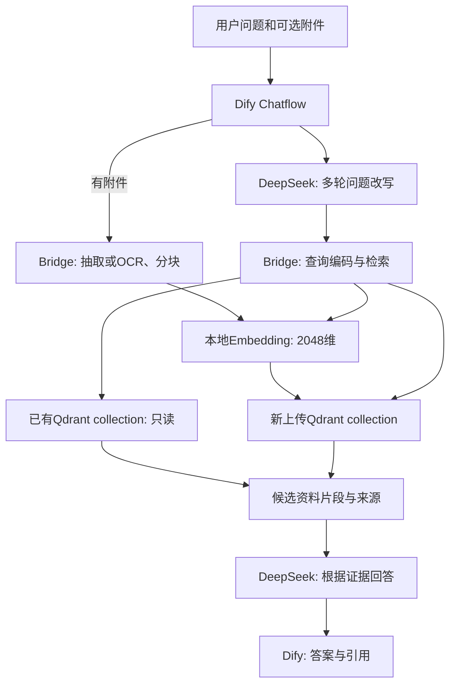

# Dify Local RAG Bridge

**将已有本地向量知识库接入 Dify，让上传文件长期可检索，并提供多轮问答和来源核对。**

这是一个在 Apple Silicon Mac 上验证过的 RAG 集成参考项目：用本地模型和 Qdrant 保存、检索资料，用 Dify 编排文件上传和问答，用 DeepSeek 根据召回片段回答。

当前版本是本机验收的作品与参考实现，尚未完成空环境自动安装、跨平台运行和生产并发验收。公开包不包含个人知识库、模型权重、账号或真实凭据。

## 对谁有用

- 已有 Qdrant 数据，希望接入 Dify 而不重建全部索引的人。
- 想理解“上传附件”如何变成跨对话可用知识的开发者。
- 希望将文档截图 OCR 与 RAG 连接起来的 macOS 用户。
- 需要通过来源片段核对回答的个人知识库使用者。
- 学过 RAG 概念，想参考一条完整数据与问答链路的人。

## 能做什么

- 外部知识库 API：`POST /retrieval`，返回内容、标题、相似度和来源元数据。
- 文件持久入库：`POST /ingest`，支持 MD、TXT、文字 PDF、PNG/JPG/JPEG/HEIC。
- 本地 OCR：使用 macOS Vision 识别截图与文档图片中的中英文。
- 旧库只读，新上传写入独立 Qdrant collection。
- 重复文件复用、部分写入隔离、入库完整性核对与重新提交修复。
- Dify 条件分支、串行迭代、HTTP 校验、检索、LLM 和回复编排。
- 多轮指代改写与引用展示；证据不足时要求模型明确说明。

## 架构与数据流



文字抽取、OCR、向量编码与数据库检索在本机执行。问题、近期对话和召回片段用于 DeepSeek 远程请求，**当前不是完全离线问答**，也会产生模型 API 费用。

## 演示方式

用 `examples/` 中的虚构项目文件：

1. 上传 `Dify界面上传验收.txt`，问“紫藤项目的负责人和验收代号是什么？”。
2. 预期得到“周岚、ZT-8632”，并能打开来源。
3. 开始新对话，不再上传，问“紫藤项目的归档日期是什么？”。
4. 预期得到“每月十五日”，验证长期入库。
5. 问文件没写的“预算金额”，预期明确说明没有足够依据。

图片示例还可测试“银杏项目负责人”和追问“它的编号是什么”。详细预期和实际验收范围见 [验收记录](docs/validation.md)。这些均是合成资料，不是实际业务记录。

## 开始使用

先读 [部署与配置说明](docs/setup.md)，再参考 [工作流配置](dify_workflows/README.md) 和 [API说明](docs/api.md)。

基本顺序：

1. 准备 Apple Silicon Mac、Python、Docker Desktop 和兼容的本地向量模型。
2. 启动 Qdrant、本地 Embedding HTTP 服务和 Bridge。
3. 自行部署 Dify，配置 DeepSeek 凭据。
4. 创建外部知识库连接。首次合成演示用 `local_uploads`；已有兼容旧库时可用 `local_all`。
5. 导入 YAML，绑定自己的 dataset ID、秘密环境变量和模型，然后发布。
6. 依照合成用例验证上传、新对话检索和来源。

YAML 中的 `REPLACE_WITH_YOUR_DIFY_DATASET_ID` 是占位符；不是可直接使用的知识库 ID。`BRIDGE_API_KEY` 保持空值，需在自己的 Dify 环境安全填写。

## 项目结构

```text
.
├── dify_bridge/                  # FastAPI、文件处理、OCR、Qdrant适配、测试
├── dify_workflows/               # Dify编排模板与配置说明
├── serve_vl_embedding.py         # 本地OpenAI风格Embedding接口
├── requirements-embedding.txt  # 本地向量服务依赖
├── examples/                    # 仅合成资料
├── docs/                        # 配置、接口、验收文档
├── THIRD_PARTY.md                # 第三方组件与授权边界
└── RELEASE_NOTES.md              # 本次公开范围与验证状态
```

## 技术与工程实践

| 组件 | 作用 |
|---|---|
| Dify Chatflow | 上传、条件分支、迭代、校验、检索和回答调度 |
| Python / FastAPI | 协议适配、Bearer认证、入库与检索接口 |
| Qdrant | 2048维向量保存与Cosine检索 |
| Qwen3-VL-Embedding / MLX | Apple Silicon本地文字向量编码 |
| pypdf | 可提取文字的PDF处理 |
| Swift / macOS Vision | 文档图片OCR |
| DeepSeek | 多轮问题改写和依据资料回答 |

项目贡献重点是这些组件之间的连接、数据处理与校验、工作流编排、验收和文档。开发过程中使用了 AI 辅助进行分析、实现与检查；第三方框架和模型不作为自研成果。

## 验收与测试

本机原链路已验证：四类资料的实际入库、Dify界面TXT上传、新对话检索、多轮指代、旧向量库正式问答、来源展示及缺少证据的测试。

适配服务的自动测试不需要真实密钥、模型或个人数据库。安装桥接依赖后，在项目根目录运行：

```sh
python -m unittest discover -s dify_bridge/tests -v
```

具体测试结果与“原本机验收”和“公开包检查”的区别见 [验收记录](docs/validation.md)。

## 已知限制

- 当前模型服务依赖 Apple Silicon/MLX，OCR依赖macOS；不宣称全平台通用。
- 每次最多5文件，每个25MB；较大资料可能超过工作流超时。
- 图片是OCR文字识别，不做照片场景或复杂图表关系理解。
- 扫描PDF没有自动逐页OCR；过短文本片段会过滤。
- 同名不同内容保留多个版本，不自动替换、删除或同步源目录。
- 当前最多召回5片段，没有独立重排；引用区可能包含弱相关候选。
- 相似度不是答案正确率；重要结论应核对原文。
- 没有生产级并发、跨机器完整部署和自动备份恢复验收。
- 远程回答依赖网络、凭据与额度。

## 下一步

计划完善干净环境部署验收、资料版本与删除管理、各格式浏览器测试、OCR质量评估和备份恢复。它们是后续计划，不是当前已经实现的功能。

## 来源与授权

参见 [第三方说明](THIRD_PARTY.md)。本次首先作为公开源码作品展示，**尚未选择项目开源许可证**，不宣称已给予任意复用授权。模型权重、Dify源码与第三方运行数据不随本仓库发布。有关公开仓库与许可证的区别，参见 [GitHub 官方说明](https://docs.github.com/en/repositories/managing-your-repositorys-settings-and-features/customizing-your-repository/licensing-a-repository)。
